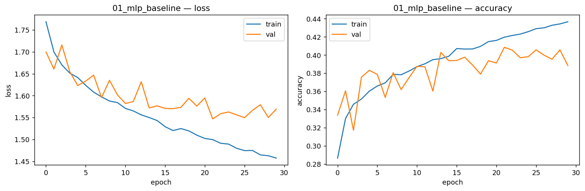
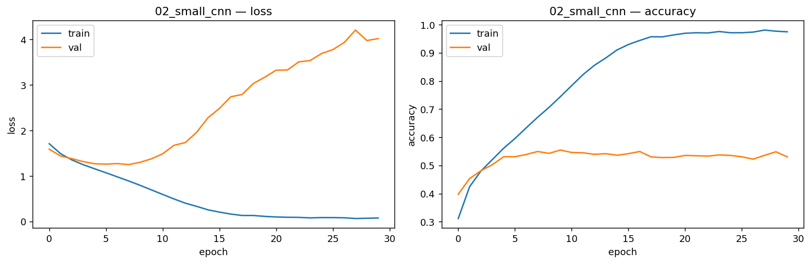
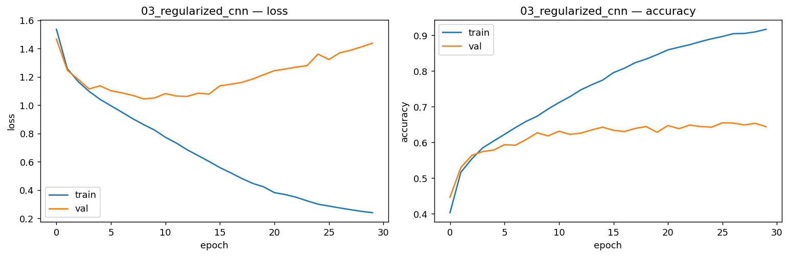
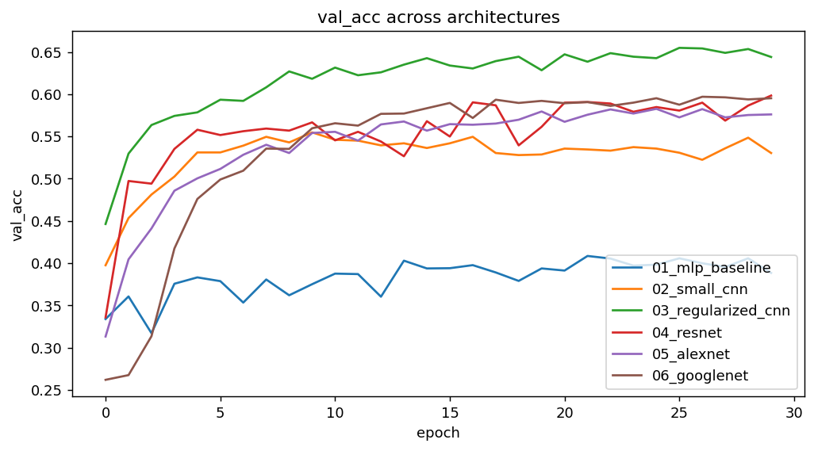
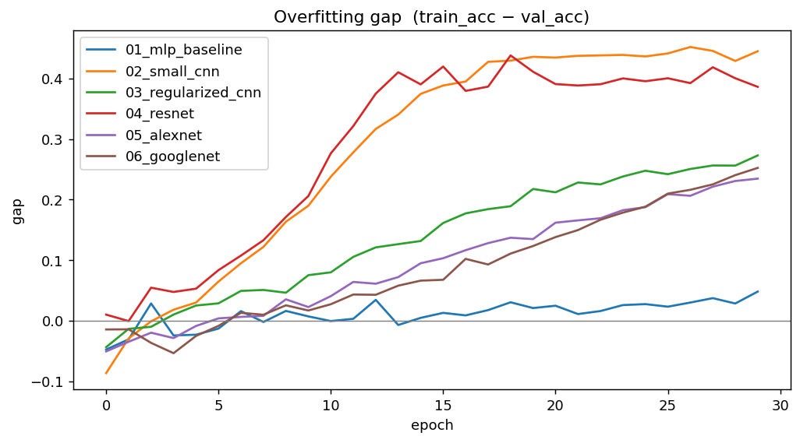

# FER2013 — სახის ემოციების ამოცნობა (იტერაციული კვლევა)

PyTorch + Weights & Biases გადაწყვეტა Kaggle-ის კონკურსისთვის
[*Challenges in Representation Learning: Facial Expression Recognition Challenge*](https://kaggle.com/competitions/challenges-in-representation-learning-facial-expression-recognition-challenge).

ამ პროექტის მიზანი არ ყოფილა მხოლოდ ერთი მაღალი შედეგის მიღწევა. დავალების
მოთხოვნის შესაბამისად, მოდელი იზრდება იტერაციულად — თითო მოტივირებული ნაბიჯით — და
ყოველ ეტაპზე train/val მრუდების მიხედვით ვმსჯელობ, თუ რა ხდება და, რაც მთავარია,
რატომ. ჩემთვის უფრო მნიშვნელოვანი იყო იმის გაგება, თუ რა იწვევს underfitting-სა და
overfitting-ს, ვიდრე უბრალოდ accuracy-ს რიცხვის გაზრდა.

## ამოცანა და მონაცემები

ამოცანაა 48×48 ზომის შავ-თეთრი სახის სურათების მიკუთვნება შვიდი ემოციიდან ერთ-ერთისთვის:
ბრაზი, ზიზღი (Disgust), შიში, სიხარული, მწუხარება, გაკვირვება და ნეიტრალური. ეს ჩანს
მარტივ ამოცანად, მაგრამ რეალურად რთულია: სურათები პატარაა, ხშირად დაბინდული ან
ნაწილობრივ დაფარული, და თვით ადამიანის სიზუსტეც კი ამ მონაცემებზე დაახლოებით 65%-ია.
ეს რიცხვი მნიშვნელოვანი ორიენტირია — თუ მოდელი ტრენინგზე 98%-ს აღწევს, ეს უკვე ეჭვის
საფუძველია, რომ ის მონაცემებს იმახსოვრებს და არა განზოგადებას სწავლობს.

სატრენინგო ფაილი `train.csv` შეიცავს დაახლოებით 28,700 დანომრილ მაგალითს. მე ის
ვყავი სატრენინგო (90%) და სავალიდაციო (10%) ნაწილებად, თანაც **stratified** წესით —
ანუ ისე, რომ თითოეული ემოციის პროპორცია ორივე ნაწილში დაცული იყოს. ეს გადაწყვეტილება
შემთხვევითი არ არის: `Disgust` კლასი დანარჩენებზე დაახლოებით ათჯერ იშვიათია, და უბრალო
შემთხვევითმა დაყოფამ შეიძლება ის სავალიდაციო ნაწილში თითქმის სრულიად არ მოახვედროს,
რაც ვალიდაციის შედეგს არასანდოს გახდიდა.

ცალკე უნდა აღინიშნოს `test.csv` — მას ლეიბლები **არ** აქვს (მხოლოდ `pixels` სვეტი), ამიტომ
მასზე accuracy-ს გამოთვლა შეუძლებელია; ის მხოლოდ Kaggle-ის ლიდერბორდისთვის გამოდგება.
სწორედ ამიტომ მთელი შეფასება ვალიდაციის ნაწილზე ხდება, რომელსაც ლეიბლები აქვს.

## მუშაობის მეთოდი

მთავარი პრინციპი იყო: **თითო ექსპერიმენტში ვცვლი მხოლოდ ერთ რამეს**, წინასწარ ვწერ
მოლოდინს და შემდეგ მრუდებით ვამოწმებ, გამართლდა თუ არა. ეს მნიშვნელოვანია, რადგან თუ
ერთდროულად რამდენიმე რამეს შევცვლი (არქიტექტურა, learning rate, რეგულარიზაცია), ვეღარ
ვიტყვი, კონკრეტულად რამ გამოიწვია შედეგის ცვლილება. ამიტომ ექსპერიმენტი 2-სა და 3-ს
შორის ერთადერთი განსხვავება სწორედ რეგულარიზაციაა — ყველა დანარჩენი (მონაცემები,
optimizer, learning rate, epoch-ების რაოდენობა) იდენტურია.

ყოველი ტრენინგის წინ ვასრულებ მცირე, მაგრამ ძალიან სასარგებლო შემოწმებებს — ე.წ.
sanity checks-ს. ისინი წუთებში ცხადყოფენ, კოდი გამართულია თუ არა, და მირჩევნია ეს
ვიცოდე, ვიდრე ნახევარი საათი დავხარჯო ტრენინგზე, რომელიც bug-ის გამოა გაფუჭებული.

## Sanity checks — რატომ ვამოწმებ forward/backward-ს

პირველი შემოწმებაა **საწყისი loss-ის** მნიშვნელობა. გაუწვრთნელი მოდელი შვიდ კლასს
დაახლოებით თანაბრად უნდა ანაწილებდეს, ამიტომ cross-entropy loss საწყისად ≈ ln(7) ≈
1.946 უნდა იყოს. თუ ეს რიცხვი სრულიად სხვაა, ესე იგი სადღაც bug-ია — არასწორი
ინიციალიზაცია, არასწორი კლასების რაოდენობა ან ლეიბლების აღრევა.

მეორე და ყველაზე გადამწყვეტი შემოწმებაა **ერთ პატარა batch-ზე overfit-ის** მცდელობა.
თუ მოდელი 64 სურათს ვერ იმახსოვრებს ~100%-მდე, მაშინ პრობლემა მონაცემების სიმცირეში კი
არა, თვითონ მოდელში ან optimizer-შია — და მთელი მონაცემების ტრენინგსაც აზრი არ აქვს.

მესამეა **გრადიენტების ნაკადის** შემოწმება: ერთი backward-ის შემდეგ ყველა ფენას უნდა
ჰქონდეს სასრული, არანულოვანი გრადიენტი. ნულოვანი გრადიენტი მკვდარ ფენაზე მიანიშნებს,
ხოლო ძალიან დიდი — არასტაბილურობაზე.

## W&B-ზე ლოგირება

ლოგირების სტრუქტურა MLflow-ის ლოგიკას იმეორებს: ერთი **project** (`fer2013-experiments`)
არის მთელი ექსპერიმენტული სივრცე, თითო **run** კი ერთ კონკრეტულ არქიტექტურას/კონფიგურაციას
შეესაბამება (`01_mlp_baseline`, `02_small_cnn`, `03_regularized_cnn`). ყოველ epoch-ზე
იწერება train და val loss/accuracy, ბოლოს კი confusion matrix და თითო კლასის accuracy.

განსაკუთრებით მნიშვნელოვანია, რომ ცალკე ვლოგავ `overfit_gap = train_acc − val_acc`-ს.
ეს ერთი რიცხვი თვალნათლივ აჩვენებს მოდელის ქცევას: როცა ის ნულთან ახლოსაა, მოდელი ან
კარგად განაზოგადებს, ან underfit-ია; როცა დიდი და მზარდია — overfitting-ია. სწორედ ამ
მეტრიკის შედარება სამ run-ს შორის ქმნის მთელი კვლევის მთავარ ხაზს.

## რეპოზიტორიის სტრუქტურა

```
ML_Wandb/
├── README.md
├── requirements.txt
├── colab.ipynb              # მთავარი: setup + ყველა ექსპერიმენტი + ჰიპერპარამეტრები (GPU)
├── analysis.ipynb           # გრაფიკები + ანალიზი ქართულად
├── save_figures.py          # README-ის გრაფიკების გენერაცია
└── src/
    ├── data.py              # FERDataset, get_loaders, get_test_loader
    ├── models.py            # MLP, SmallCNN, RegularizedCNN, ResNetMini, AlexNetSmall, InceptionSmall
    ├── train.py             # სატრენინგო ციკლი + W&B ლოგირება
    ├── utils.py             # sanity checks (forward/backward)
    └── plots.py             # Plotter — გრაფიკები W&B-დან
```

## გაშვება

პროექტი ეშვება **Colab-ზე (GPU)**:

1. გახსენი `colab.ipynb` Colab-ში და ჩართე GPU: Runtime → Change runtime type → GPU.
2. Secrets (🔑) → დაამატე `WANDB_KEY`.
3. გაუშვი **setup** უჯრა — ატვირთავ `kaggle.json`-ს და `train.csv` ავტომატურად ჩამოიტვირთება.
4. გაუშვი sanity check, არქიტექტურებისა და ჰიპერპარამეტრების უჯრები (რომელიც გინდა).
5. ბოლოს გაუშვი `analysis.ipynb` — ყველა run-ს იღებს W&B-დან და ხატავს მრუდებს.

## იტერაცია 1 — MLP და underfitting



პირველი მოდელი მაქსიმალურად მარტივია: სურათი იშლება 2304-განზომილებიან ვექტორად და
გადის ორ fully-connected ფენაში. შეგნებულად დავიწყე ასე სუსტი მოდელით, რომ მქონოდა
საბაზისო ზღვარი, რომელსაც შემდეგ ვცემ.

ჩემი მოლოდინი იყო underfitting, და ზუსტად ასეც მოხდა: ვალიდაციის accuracy ~0.40-ზე
გაჩერდა და train-თან ერთად, თითქმის პარალელურად მიდიოდა (gap ძალიან პატარაა).
მნიშვნელოვანია ამის სწორად წაკითხვა — დაბალი accuracy და **პატარა** gap ერთად სწორედ
underfitting-ის ნიშანია: მოდელი სატრენინგო მონაცემებსაც კი ცუდად ერგება, ამიტომ
„დასამახსოვრებელი" არაფერი აქვს და overfitting-ი ვერ ვითარდება.

რატომ ხდება ეს? იმიტომ, რომ flatten ანადგურებს სურათის სივრცით სტრუქტურას. სანამ
ვაბრტყელებთ, მეზობელი პიქსელები ერთმანეთთან ახლოს იყვნენ და ერთად ქმნიდნენ ნიშნებს
(კიდეები, თვალი, პირის ფორმა); flatten-ის შემდეგ კი ისინი უბრალოდ 2304 დამოუკიდებელი
რიცხვია, და მოდელს ეს კავშირები ნულიდან უწევს სწავლა — შეზღუდული ტევადობით. ამიტომ აქ
არ ღირს არც მეტი რეგულარიზაცია (მოდელი ისედაც არ ფიტავს) — სწორი ნაბიჯი უკეთესი
ინდუქციური bias-ია, ანუ კონვოლუცია.

## იტერაცია 2 — SmallCNN და overfitting



მეორე მოდელში დავამატე სამი კონვოლუციური ბლოკი. კონვოლუცია სწორედ იმ ინდუქციურ bias-ს
ამატებს, რაც MLP-ს აკლდა: ლოკალურობას (ახლომდებარე პიქსელები ერთად მუშავდება) და წონების
გაზიარებას (ერთი და იგივე ფილტრი მთელ სურათზე გადადის). შედეგად ტრენინგის accuracy
მკვეთრად, ~0.98-მდე ავიდა — ანუ მოდელს ნამდვილად **შეუძლია** მონაცემების ფიტვა.

მაგრამ რეგულარიზაცია (BatchNorm/Dropout) საერთოდ არ მქონდა, FC თავი კი დიდია, ამიტომ
მოდელმა სატრენინგო ნაკრების დამახსოვრება დაიწყო. ვალიდაცია ~0.54-ზე გაიყინა, gap კი
სწრაფად გაიზარდა — კლასიკური overfitting.

აქ ერთი დეტალია, რომელზეც განსაკუთრებით ღირს მსჯელობა: ვალიდაციის accuracy ~0.54-ზე
ჩერდება, **მაგრამ ვალიდაციის loss 1.2-დან ~4.0-მდე იზრდება**. ერთი შეხედვით ეს
წინააღმდეგობრივია — თუ loss იზრდება, accuracy რატომ არ ეცემა? ახსნა ისაა, რომ მოდელი
სულ უფრო თავდაჯერებული ხდება არასწორ პასუხებშიც. cross-entropy მკაცრად სჯის
თავდაჯერებულ შეცდომას: თუ მოდელი არასწორ კლასს 0.99 ალბათობას ანიჭებს, loss მკვეთრად
იზრდება, თუნდაც პროგნოზირებული კლასი (ე.ი. accuracy) არ შეცვლილიყო. ეს overfitting-ის
ერთ-ერთი ყველაზე ნათელი ნიშანია და სწორედ ის მოტივს მაძლევს შემდეგი ნაბიჯისთვის.

## იტერაცია 3 — RegularizedCNN (BatchNorm + Dropout)



მესამე მოდელი იგივე CNN-ია, ოღონდ თითო ბლოკში ორი კონვოლუცია, ყოველი კონვოლუციის
შემდეგ BatchNorm და ბლოკის ბოლოს Dropout(0.4). შეგნებულად დავტოვე ყველაფერი დანარჩენი
ისეთი, როგორიც ექსპერიმენტ 2-ში იყო, რომ ცვლილების ეფექტი მხოლოდ რეგულარიზაციას
დავაკისრო.

ორ მექანიზმს განსხვავებული როლი აქვს. BatchNorm აქტივაციებს ნორმალიზებას ახდენს და
ოპტიმიზაციას ასტაბილურებს — ტრენინგი უფრო სწრაფი და მდგრადია. Dropout კი ტრენინგისას
ნეირონების ნაწილს შემთხვევით თიშავს, რაც მოდელს უშლის ხელს ზედმეტად დაეყრდნოს
კონკრეტულ ნეირონებს და, შესაბამისად, ამცირებს დამახსოვრებას.

შედეგი მკაფიოა: ვალიდაციის საუკეთესო accuracy ~0.655-მდე ავიდა — სამივე მოდელიდან
საუკეთესო — და gap ბევრად უფრო კონტროლირებადია, ვიდრე SmallCNN-ში. თუმცა სრულად
overfitting არ აღმოფხვრილა: ვალიდაციის loss მინიმუმს ~მე-8 epoch-ზე აღწევს და შემდეგ
ისევ იწყებს ზრდას. ანუ რეგულარიზაციამ პრობლემა შეამცირა, მაგრამ მოდელს ჯერ კიდევ აქვს
ჭარბი ტევადობა, რომელსაც დამახსოვრებაზე ხარჯავს. სწორედ ეს მიჩვენებს, რომ შემდეგი
ბუნებრივი ნაბიჯი data augmentation-ი ან early stopping-ია.

## შედარებითი მსჯელობა





თუ სამ ექსპერიმენტს ერთად შევხედავთ, იკვეთება ნათელი ხაზი. MLP-მა გვაჩვენა, რომ
ტევადობისა და სწორი ინდუქციური bias-ის გარეშე მოდელი მონაცემებსაც კი ვერ ერგება
(underfit). SmallCNN-მა დაამტკიცა, რომ კონვოლუცია სწორი არჩევანია, მაგრამ
რეგულარიზაციის გარეშე ტევადობა დამახსოვრებაში გადაიზრდება (overfit). RegularizedCNN-მა
კი აჩვენა, რომ პრობლემა არქიტექტურის გადაგდებით კი არ წყდება, არამედ იმავე არქიტექტურის
სწორი რეგულარიზაციით.

ამ მთელ ისტორიას ყველაზე კარგად `overfit_gap`-ის ევოლუცია აჯამებს: MLP-ში ის თითქმის
ნულია (მაგრამ ცუდი მიზეზით — accuracy დაბალია), SmallCNN-ში დიდი და მზარდი,
RegularizedCNN-ში კი ზომიერი. ანუ კარგი მოდელი ის არ არის, ვისაც პატარა gap აქვს, არამედ
ის, ვისაც **მაღალი val accuracy და გონივრული gap ერთად** აქვს.

ცალკე აღსანიშნავია კლასების დისბალანსი. `Disgust`-ის სიმცირის გამო, confusion matrix-ში
სწორედ ეს კლასი ზუსტდება ყველაზე ცუდად. ეს კარგად აჩვენებს, თუ რატომ არ არის accuracy
ერთადერთი საზომი: საშუალო accuracy შეიძლება მაღალი იყოს, მაშინ როცა იშვიათ კლასს მოდელი
პრაქტიკულად ვერ ცნობს.

## დასკვნა და შემდეგი ნაბიჯები

სამმა იტერაციამ დაფარა ის სამი ტიპური სიტუაცია, რომელიც დავალებას აინტერესებდა:
underfit, overfit და მათ შორის ბალანსი. შემდეგი ნაბიჯები ბუნებრივად გამომდინარეობს
RegularizedCNN-ის დარჩენილი overfitting-დან:

- **Data augmentation** (გადაბრუნება/ჭრა) — ეფექტურად ზრდის მონაცემთა მრავალფეროვნებას
  და სწორედ overfitting-ის წინააღმდეგ მუშაობს; `augment` ფლაგი უკვე არსებობს `data.py`-ში.
- **Early stopping** — ვინაიდან val loss მე-8 epoch-ის შემდეგ იზრდება, აზრი არ აქვს
  ბოლომდე ტრენინგს; საუკეთესო მოდელი ისედაც ინახება.
- **ჰიპერპარამეტრების გადარჩევა** — learning rate, optimizer, weight decay, dropout.
- **კლასის წონები** — `Disgust`-ის ამოსაცნობად loss-ის შეწონვა იშვიათი კლასის სასარგებლოდ.

## შენიშვნები

რეპროდუცირებადობისთვის დაყოფა ფიქსირებული seed-ით ხდება. საიდუმლო მონაცემები
(`kaggle.json`, API keys) git-ignored-ია და არასდროს ინახება კოდში.
