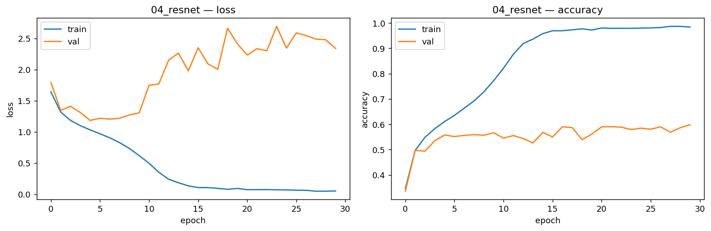
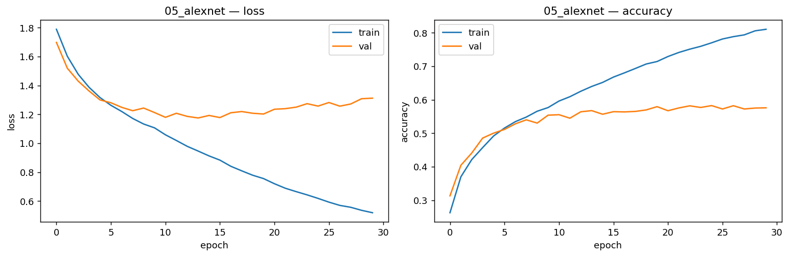
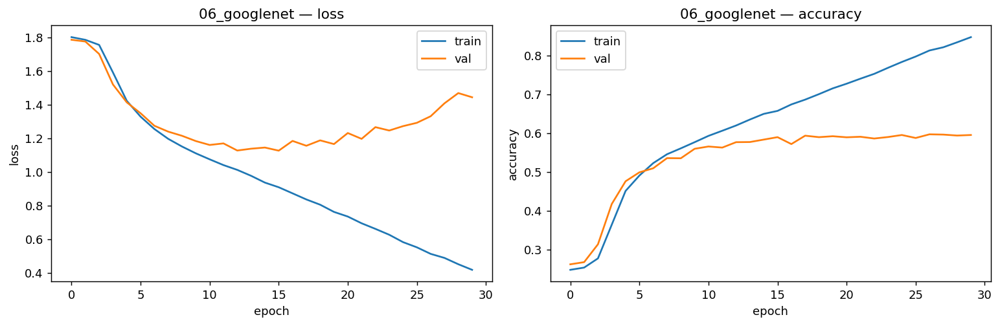
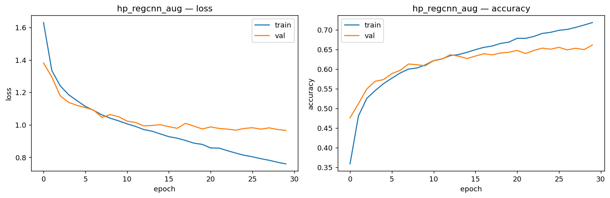

# FER2013 — სახის ემოციების ამოცნობა (იტერაციული კვლევა)

PyTorch + Weights & Biases გადაწყვეტა Kaggle-ის კონკურსისთვის
[*Challenges in Representation Learning: Facial Expression Recognition Challenge*](https://kaggle.com/competitions/challenges-in-representation-learning-facial-expression-recognition-challenge).

ამ პროექტის მიზანი არ ყოფილა მხოლოდ ერთი მაღალი შედეგის მიღწევა. დავალების
მოთხოვნის შესაბამისად, მოდელი იზრდება იტერაციულად — თითო მოტივირებული ნაბიჯით — და
ყოველ ეტაპზე train/val მრუდების მიხედვით ვმსჯელობ, თუ რა ხდება და, რაც მთავარია,
რატომ. ჩემთვის უფრო მნიშვნელოვანი იყო იმის გაგება, თუ რა იწვევს underfitting-სა და
overfitting-ს, ვიდრე უბრალოდ accuracy-ს რიცხვის გაზრდა.

## ამოცანა და მონაცემები

ამოცანაა 48×48 ზომის შავ-თეთრი სახის სურათების მიკუთვნება შვიდი ემოციიდან ერთ-ერთისთვის:
ბრაზი, ზიზღი (Disgust), შიში, სიხარული, მწუხარება, გაკვირვება და ნეიტრალური. ეს ჩანს
მარტივ ამოცანად, მაგრამ რეალურად რთულია: სურათები პატარაა, ხშირად დაბინდული ან
ნაწილობრივ დაფარული, და თვით ადამიანის სიზუსტეც კი ამ მონაცემებზე დაახლოებით 65%-ია.
ეს რიცხვი მნიშვნელოვანი ორიენტირია — თუ მოდელი ტრენინგზე 98%-ს აღწევს, ეს უკვე ეჭვის
საფუძველია, რომ ის მონაცემებს იმახსოვრებს და არა განზოგადებას სწავლობს.

სატრენინგო ფაილი `train.csv` შეიცავს დაახლოებით 28,700 დანომრილ მაგალითს. მე ის
ვყავი სატრენინგო (90%) და სავალიდაციო (10%) ნაწილებად, თანაც **stratified** წესით —
ანუ ისე, რომ თითოეული ემოციის პროპორცია ორივე ნაწილში დაცული იყოს. ეს გადაწყვეტილება
შემთხვევითი არ არის: `Disgust` კლასი დანარჩენებზე დაახლოებით ათჯერ იშვიათია, და უბრალო
შემთხვევითმა დაყოფამ შეიძლება ის სავალიდაციო ნაწილში თითქმის სრულიად არ მოახვედროს,
რაც ვალიდაციის შედეგს არასანდოს გახდიდა.

ცალკე უნდა აღინიშნოს `test.csv` — მას ლეიბლები **არ** აქვს (მხოლოდ `pixels` სვეტი), ამიტომ
მასზე accuracy-ს გამოთვლა შეუძლებელია; ის მხოლოდ Kaggle-ის ლიდერბორდისთვის გამოდგება.
სწორედ ამიტომ მთელი შეფასება ვალიდაციის ნაწილზე ხდება, რომელსაც ლეიბლები აქვს.

## მუშაობის მეთოდი

მთავარი პრინციპი იყო: **თითო ექსპერიმენტში ვცვლი მხოლოდ ერთ რამეს**, წინასწარ ვწერ
მოლოდინს და შემდეგ მრუდებით ვამოწმებ, გამართლდა თუ არა. ეს მნიშვნელოვანია, რადგან თუ
ერთდროულად რამდენიმე რამეს შევცვლი (არქიტექტურა, learning rate, რეგულარიზაცია), ვეღარ
ვიტყვი, კონკრეტულად რამ გამოიწვია შედეგის ცვლილება. ამიტომ ექსპერიმენტი 2-სა და 3-ს
შორის ერთადერთი განსხვავება სწორედ რეგულარიზაციაა — ყველა დანარჩენი (მონაცემები,
optimizer, learning rate, epoch-ების რაოდენობა) იდენტურია.

ყოველი ტრენინგის წინ ვასრულებ მცირე, მაგრამ ძალიან სასარგებლო შემოწმებებს — ე.წ.
sanity checks-ს. ისინი წუთებში ცხადყოფენ, კოდი გამართულია თუ არა, და მირჩევნია ეს
ვიცოდე, ვიდრე ნახევარი საათი დავხარჯო ტრენინგზე, რომელიც bug-ის გამოა გაფუჭებული.

## Sanity checks — რატომ ვამოწმებ forward/backward-ს

პირველი შემოწმებაა **საწყისი loss-ის** მნიშვნელობა. გაუწვრთნელი მოდელი შვიდ კლასს
დაახლოებით თანაბრად უნდა ანაწილებდეს, ამიტომ cross-entropy loss საწყისად ≈ ln(7) ≈
1.946 უნდა იყოს. თუ ეს რიცხვი სრულიად სხვაა, ესე იგი სადღაც bug-ია — არასწორი
ინიციალიზაცია, არასწორი კლასების რაოდენობა ან ლეიბლების აღრევა.

მეორე და ყველაზე გადამწყვეტი შემოწმებაა **ერთ პატარა batch-ზე overfit-ის** მცდელობა.
თუ მოდელი 64 სურათს ვერ იმახსოვრებს ~100%-მდე, მაშინ პრობლემა მონაცემების სიმცირეში კი
არა, თვითონ მოდელში ან optimizer-შია — და მთელი მონაცემების ტრენინგსაც აზრი არ აქვს.

მესამეა **გრადიენტების ნაკადის** შემოწმება: ერთი backward-ის შემდეგ ყველა ფენას უნდა
ჰქონდეს სასრული, არანულოვანი გრადიენტი. ნულოვანი გრადიენტი მკვდარ ფენაზე მიანიშნებს,
ხოლო ძალიან დიდი — არასტაბილურობაზე. სამივე შემოწმება სრულდება ექვსივე არქიტექტურაზე.

## W&B-ზე ლოგირება

ლოგირების სტრუქტურა MLflow-ის ლოგიკას იმეორებს: ერთი **project** (`fer2013-experiments`)
არის მთელი ექსპერიმენტული სივრცე, თითო **run** კი ერთ კონკრეტულ არქიტექტურას/კონფიგურაციას
შეესაბამება (`01_mlp_baseline`, `02_small_cnn`, …, `hp_regcnn_aug`). ყოველ epoch-ზე
იწერება train და val loss/accuracy, ბოლოს კი confusion matrix და თითო კლასის accuracy.

განსაკუთრებით მნიშვნელოვანია, რომ ცალკე ვლოგავ `overfit_gap = train_acc − val_acc`-ს.
ეს ერთი რიცხვი თვალნათლივ აჩვენებს მოდელის ქცევას: როცა ის ნულთან ახლოსაა, მოდელი ან
კარგად განაზოგადებს, ან underfit-ია; როცა დიდი და მზარდია — overfitting-ია. სწორედ ამ
მეტრიკის შედარება run-ებს შორის ქმნის მთელი კვლევის მთავარ ხაზს.

## რეპოზიტორიის სტრუქტურა

```
ML_Wandb/
├── README.md
├── requirements.txt
├── colab.ipynb              # მთავარი: setup + ყველა ექსპერიმენტი + ჰიპერპარამეტრები (GPU)
├── analysis.ipynb           # გრაფიკები + ანალიზი ქართულად
├── save_figures.py          # README-ის გრაფიკების გენერაცია
└── src/
    ├── data.py              # FERDataset, get_loaders, get_test_loader
    ├── models.py            # MLP, SmallCNN, RegularizedCNN, ResNetMini, AlexNetSmall, InceptionSmall
    ├── train.py             # სატრენინგო ციკლი + W&B ლოგირება
    ├── utils.py             # sanity checks (forward/backward)
    └── plots.py             # Plotter — გრაფიკები W&B-დან
```

## გაშვება

პროექტი ეშვება **Colab-ზე (GPU)**:

1. გახსენი `colab.ipynb` Colab-ში და ჩართე GPU: Runtime → Change runtime type → GPU.
2. Secrets (🔑) → დაამატე `WANDB_KEY`.
3. გაუშვი **setup** უჯრა — ატვირთავ `kaggle.json`-ს და `train.csv` ავტომატურად ჩამოიტვირთება.
4. გაუშვი sanity check, არქიტექტურებისა და ჰიპერპარამეტრების უჯრები (რომელიც გინდა).
5. ბოლოს გაუშვი `analysis.ipynb` — ყველა run-ს იღებს W&B-დან და ხატავს მრუდებს.

## იტერაცია 1 — MLP და underfitting


პირველი მოდელი მაქსიმალურად მარტივია: სურათი იშლება 2304-განზომილებიან ვექტორად და
გადის ორ fully-connected ფენაში. შეგნებულად დავიწყე ასე სუსტი მოდელით, რომ მქონოდა
საბაზისო ზღვარი, რომელსაც შემდეგ ვცემ.

ჩემი მოლოდინი იყო underfitting, და ზუსტად ასეც მოხდა: ვალიდაციის accuracy **~0.41**-ზე
გაჩერდა და train-თან ერთად, თითქმის პარალელურად მიდიოდა (gap ~0.05, ძალიან პატარა).
მნიშვნელოვანია ამის სწორად წაკითხვა — დაბალი accuracy და **პატარა** gap ერთად სწორედ
underfitting-ის ნიშანია: მოდელი სატრენინგო მონაცემებსაც კი ცუდად ერგება, ამიტომ
„დასამახსოვრებელი" არაფერი აქვს და overfitting-ი ვერ ვითარდება.

რატომ ხდება ეს? იმიტომ, რომ flatten ანადგურებს სურათის სივრცით სტრუქტურას. მეზობელი
პიქსელები ერთად ქმნიდნენ ნიშნებს (კიდეები, თვალი, პირის ფორმა); flatten-ის შემდეგ კი
ისინი უბრალოდ 2304 დამოუკიდებელი რიცხვია. ამიტომ აქ არ ღირს არც მეტი რეგულარიზაცია
(მოდელი ისედაც არ ფიტავს) — სწორი ნაბიჯი უკეთესი ინდუქციური bias-ია, ანუ კონვოლუცია.
ამის დასტურია ისიც, რომ optimizer-ის შეცვლამ (Adam → SGD) თითქმის არაფერი შეცვალა:
**0.408 vs 0.406** — underfitting-ს optimizer ვერ აგვარებს.

## იტერაცია 2 — SmallCNN და overfitting


მეორე მოდელში დავამატე სამი კონვოლუციური ბლოკი. კონვოლუცია სწორედ იმ ინდუქციურ bias-ს
ამატებს, რაც MLP-ს აკლდა: ლოკალურობას და წონების გაზიარებას. შედეგად ტრენინგის accuracy
მკვეთრად, **~0.98**-მდე ავიდა — ანუ მოდელს ნამდვილად **შეუძლია** მონაცემების ფიტვა.

მაგრამ რეგულარიზაცია (BatchNorm/Dropout) საერთოდ არ მქონდა, FC თავი კი დიდია, ამიტომ
მოდელმა დამახსოვრება დაიწყო. ვალიდაცია **~0.55**-ზე გაიყინა, gap კი **~0.45**-მდე
გაიზარდა — კლასიკური overfitting.

აქ ერთი დეტალია, რომელზეც განსაკუთრებით ღირს მსჯელობა: ვალიდაციის accuracy ~0.55-ზე
ჩერდება, **მაგრამ ვალიდაციის loss 1.25-დან ~4.0-მდე იზრდება**. ერთი შეხედვით ეს
წინააღმდეგობრივია — თუ loss იზრდება, accuracy რატომ არ ეცემა? ახსნა ისაა, რომ მოდელი
სულ უფრო თავდაჯერებული ხდება არასწორ პასუხებშიც. cross-entropy მკაცრად სჯის
თავდაჯერებულ შეცდომას: არასწორ კლასს 0.99 ალბათობა → loss მკვეთრად იზრდება, თუნდაც
accuracy არ შეცვლილიყო. ეს overfitting-ის ერთ-ერთი ყველაზე ნათელი ნიშანია.

## იტერაცია 3 — RegularizedCNN (BatchNorm + Dropout)


მესამე მოდელი იგივე CNN-ია, ოღონდ თითო ბლოკში ორი კონვოლუცია, ყოველი კონვოლუციის
შემდეგ BatchNorm და ბლოკის ბოლოს Dropout(0.4). data/optimizer იგივეა, რაც ექსპერიმენტ
2-ში, რომ ცვლილების ეფექტი მხოლოდ რეგულარიზაციას დავაკისრო.

შედეგი მკაფიოა: ვალიდაციის საუკეთესო accuracy **~0.65**-მდე ავიდა — საუკეთესო ყველა
„სუფთა" არქიტექტურიდან. თუმცა სრულად overfitting არ აღმოფხვრილა: train ~0.92, gap ~0.27,
და val loss მინიმუმს ~მე-8 epoch-ზე აღწევს (1.045), შემდეგ კი ისევ იზრდება (1.44-მდე).
ანუ რეგულარიზაციამ პრობლემა მნიშვნელოვნად შეამcირა, მაგრამ მოდელს ჯერ კიდევ აქვს ჭარბი
ტევადობა. სწორედ ეს მიჩვენებს, რომ შემდეგი ნაბიჯი data augmentation-ია (იხ. ქვემოთ).

## იტერაცია 4–6 — კლასიკური არქიტექტურები (ResNet, AlexNet, GoogLeNet)

სანამ რეგულარიზაციას augmentation-ით გავაძლიერებდი, ჯერ ვცადე ლექციაზე ნახსენები
კლასიკური არქიტექტურები — 48×48×1-ზე ადაპტირებული.



**ResNet** (skip connection-ები): val **~0.60**, მაგრამ train **0.98** და gap **0.39**,
val loss → 2.34. skip connection-ებმა ოპტიმიზაცია გააადვილა (ღრმა ქსელი ისწავლა), მაგრამ
augmentation-ის გარეშე მაინც ძლიერ overfit-ია — სიღრმე თავისთავად განზოგადებას არ
აუმჯობესებს.



**AlexNet** (დიდი FC თავი): val **~0.58**, train 0.81, gap ~0.24. ზუსტად მოლოდინისამებრ —
დიდი FC თავი overfit-ისკენ იხრება, თუმცა Dropout-ის წყალობით SmallCNN-ზე ნაკლებად.



**GoogLeNet / Inception** (პარალელური 1×1/3×3/5×5 ფილტრები): val **~0.60**, train 0.85,
gap ~0.25.

**მთავარი დასკვნა:** არც ერთმა „რთულმა" არქიტექტურამ ვერ აჯობა კარგად რეგულარიზებულ
მარტივ CNN-ს (RegularizedCNN 0.65 vs ResNet/GoogLeNet ~0.60 vs AlexNet ~0.58). ე.ი. ამ
ამოცანაზე **რეგულარიზაცია უფრო მნიშვნელოვანია, ვიდრე არქიტექტურის სიღრმე/სირთულე**.

## შედარებითი მსჯელობა


რანჟირება val accuracy-ით: RegularizedCNN (0.65) > GoogLeNet ≈ ResNet (0.60) > AlexNet
(0.58) > SmallCNN (0.55) ≫ MLP (0.41). `overfit_gap`-ის გრაფიკი კი მთელ ისტორიას აჯამებს:
MLP-ში ~0 (მაგრამ ცუდი მიზეზით — accuracy დაბალია), SmallCNN/ResNet-ში დიდი და მზარდი
(0.39–0.45), RegularizedCNN-ში ზომიერი (0.27). ანუ კარგი მოდელი ის არ არის, ვისაც პატარა
gap აქვს, არამედ ის, ვისაც **მაღალი val accuracy და გონივრული gap ერთად** აქვს.

## ჰიპერპარამეტრების გადარჩევა (შედეგები)

თითო არქიტექტურაზე გადავარჩიე ჰიპერპარამეტრები (baseline-თან შედარებით). მთავარი
დასკვნები:

- **learning rate ყველაზე კრიტიკულია.** `lr=1e-2` ძალიან მაღალი აღმოჩნდა — SmallCNN,
  AlexNet და GoogLeNet სამივე „ჩავარდა" val ≈ **0.25**-ზე (გაიჭედა ერთ კლასზე). პირიქით,
  უფრო დაბალმა `lr=3e-4`-მა AlexNet **გააუმჯობესა** (0.58 → **0.61**). ანუ ცუდი lr ყველაზე
  მძიმე შეცდომაა.
- **weight decay** ამცირებს gap-ს: RegularizedCNN-ზე `wd=1e-3` → gap 0.27-დან **0.035**-მდე
  დაეცა (val 0.629, მცირე დათმობით); `wd=1e-4` → val 0.645, gap 0.17. ანუ weight decay
  ცვლის accuracy-ს მცირედ, სამაგიეროდ განზოგადებას აუმჯობესებს.
- **optimizer** (MLP-ზე Adam vs SGD): 0.408 vs 0.406 — პრაქტიკულად ერთი და იგივე, რაც
  კიდევ ერთხელ ადასტურებს, რომ optimizer underfitting-ს ვერ შველის.

## საუკეთესო მოდელი — data augmentation



ყველაზე ეფექტური ნაბიჯი augmentation-ი აღმოჩნდა (შემთხვევითი გადაბრუნება + ჭრა).
**RegularizedCNN + augmentation** მივიდა **val ≈ 0.66**-მდე — საუკეთესო შედეგი მთელ
კვლევაში, თითქმის ადამიანის დონეზე (~0.65). და რაც მთავარია, **overfitting გაქრა**:
gap ~0.27-დან **~0.05**-მდე დაეცა და val loss აღარ იზრდება (~0.95-ზე სტაბილდება, აღარ
ადის 1.44-მდე).

augmentation-მა ResNet-საც უშველა (0.60 → **0.62**, gap 0.39 → 0.10). ე.ი. იგივე
არქიტექტურა, მაგრამ ხელოვნურად გაზრდილი მონაცემთა მრავალფეროვნება, ბევრად უკეთ
განაზოგადებს.

## underfit / overfit დემონსტრაცია

ანალიზის გასამყარებლად შეგნებულად გამოვიწვიე ორი წარუმატებლობა:

- **ექსტრემალური overfit** — ტრენინგი მხოლოდ 500 სურათზე: train **0.99**, val **0.37**,
  gap **0.62**. მოდელმა 500 სურათი დაიმახსოვრა, მაგრამ ვერ განაზოგადა.
- **divergence** — `lr=0.5` (ძალიან მაღალი): ტრენინგი „ჩავარდა" val **0.25**-ზე
  (train 0.23), loss არ ეცემა. ცუდი learning rate-ის ვიზუალური მაგალითი.

## დასკვნა

სრული სურათი: **underfit** (MLP 0.41) → **overfit** (SmallCNN/ResNet, train ~0.98) →
**რეგულარიზებული** (RegularizedCNN 0.65) → **augmentation** (RegularizedCNN+aug **0.66**,
საუკეთესო). ძირითადი გაკვეთილები:

1. სწორი ინდუქციური bias (კონვოლუცია) უფრო მნიშვნელოვანია, ვიდრე ტევადობა (MLP ვერ ისწავლა).
2. რეგულარიზაცია (BatchNorm + Dropout + weight decay) და განსაკუთრებით **augmentation**
   უფრო ეფექტურია, ვიდრე უფრო რთული არქიტექტურა.
3. **learning rate** ყველაზე კრიტიკული ჰიპერპარამეტრია; optimizer-ის არჩევანი underfitting-ს ვერ შველის.

შემდგომი იდეები: `Disgust`-ის (იშვიათი კლასი) ამოსაცნობად loss-ის შეწონვა, learning-rate
schedule, და მოდელების ensemble.

## შენიშვნები

რეპროდუცირებადობისთვის დაყოფა ფიქსირებული seed-ით ხდება. საიდუმლო მონაცემები
(`kaggle.json`, API keys) git-ignored-ია და არასდროს ინახება კოდში.
